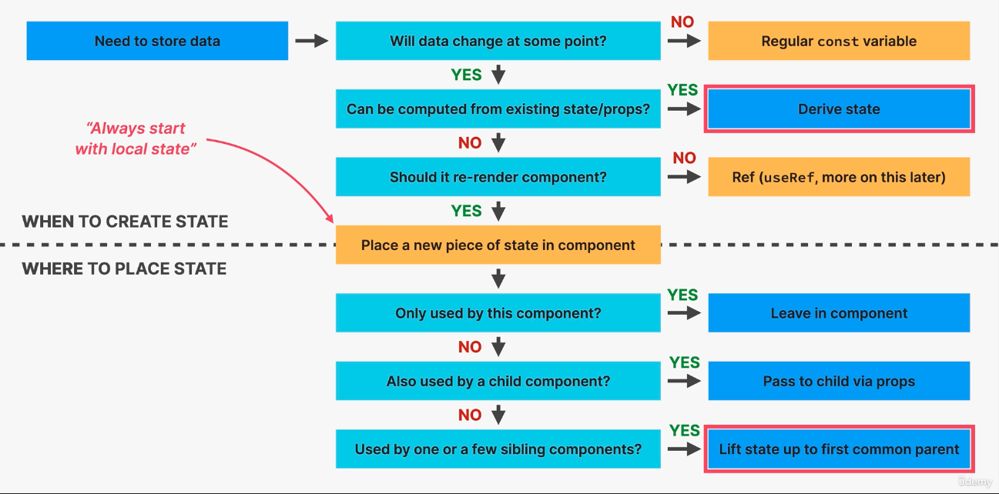

# Working with Controlled Elements

- We can access the data in forms, using event object.
- But in react we use Controlled Elements to do that.
- With this, it is React who controls the state of the elements in the form and not DOM.

# 3 Step Approach

1. Create a piece of state (e.g. description)
2. Use the state as the value of the input element (e.g. value={description})
3. listen for the change event using onChange prop (e.g. onChange={e => setDescription(e.target.value)})

- These steps will let React control the form element instead of DOM.
- Make sure that if you are assigning numbers they value is converted to number, as the e.target.value will be string most of the times.

# Thinking in REACT

- How to work with React API and Thinking in React.
- React Mindset: Always think in terms of state transitions and not element modification

## Process

1. Break the UI into components and eastablish the component tree
2. Build the static version in React (without state)
3. Think about state (State Management)

- when to use
- types (global and local)
- where to place the state

4. Establish data flow (State Management)

- one-way data flow
- child-to-parent communication
- Accessing global state

## When you know, you should be able to answer:

- How to break up UI design into components?
- How to make some components reusable?
- How to assemble UI from reusable components?
- What pieces of state do we need to interactivity?
- Where the state should reside?
- What type of state can be used?
- How to workout the data flow?

# Fundamentals of State Management

We know that "State" is the most important concept in react. So, management of state is most important topic.

## What is state management?

- Deciding when to create, what type of state, where to place the state and how the data flows through the app is called "State Management".
- In simpler words: Giving each piece of state a "home".
- As application grows, the need to find the perfect home for a state is more and more important.

## Types of State (Global v/s Local)

- Local state is needed in one or a few components.
- Defined in a component, and is used by the same or a "few" child components.

- Global state is used by many different components.
- Shared between all the components i.e called "Shared state"
- example: Redux, Context API

## How to decide when we need state, and where to place it?

