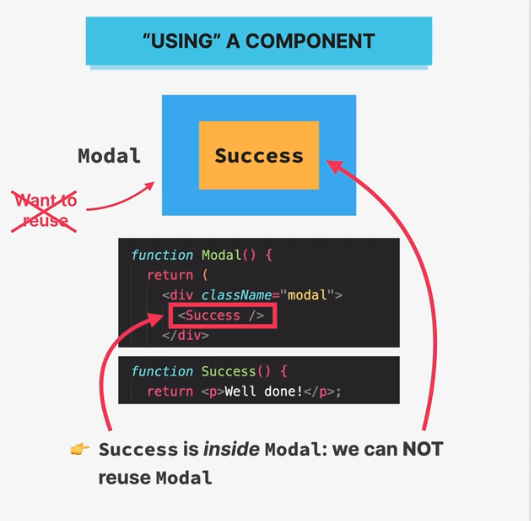
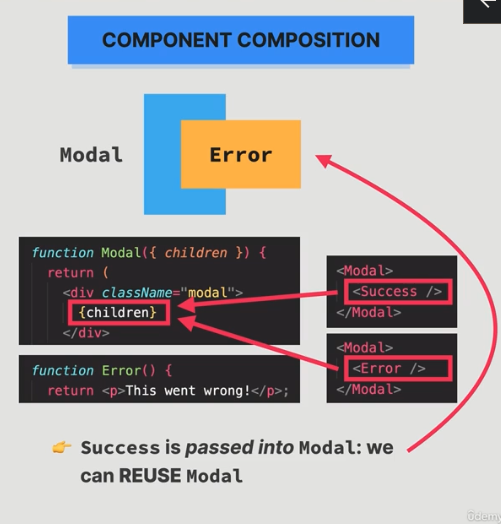

# Thinking IN React: Components, Composition, and Reusability

## How to split components

### Component size matters

We should not go for too small or too large components.
Large component:

- Either a component has too much going on
- it recieves too many components
- Hard to reuse

Small component:

- 100s of mini-components
- confusing codebase
- too abstract

### How to split UI into Components?

4 Criteria:

- Logical Separation of content/layout
- Reusability
- Responsibilities/Complexity
- Personal Coding Style

Thumb Rule: "When in doubt, start with a relatively big component, then split it into smaller components as it becomes necessary"

### Framework: When to create a new component?

- Does the component contain pieces of content or layout that don't belong together?
- Is it possible to reuse part of the component?
- Do you want or need to reuse it?
- Is the component doing too many different things?
- Does the component rely on too many props?
- Does the component have too many pieces of state or effects?
- Is the code, including JSX, too complex or confusing?
- Do you prefer smaller function/components?

#### If the answer is yes to any of the above questions: You might need a new component.

### Guidelines:

Adding a new component creates a new abstraction. Abstractions have a cost, because, more abstractions require more mental energy to switch back and forth between components. So try not to create new components too early.

Name a component according to what it is does or what it displays. Don't be afraid of using long component names.

Never declare a new component inside another component!

co-locate related components inside the same file/folder (when working in industry).

It's completely normal that an app has components of many different sizes, including very small and huge one's.

We ofcourse need some small components which are less complex and highly reusable. And a few huge components, which are not reusable (NOT a problem)

## Component Categories

1. Stateless/Presentational Components:

- They do not have states, generally recieve props, and present them.
- Usually small and reusable.
- E.g. Logo, NumResults, Movie, WatchedSummary, WatchedMoviesList, WatchedMovie

2. Stateful Components:

- They have state.
- Can still be Reused.
- E.g. Search, ListBox, MovieList, WatchedBox

3. Structural Components:

- They are usually: "Pages", "Layouts", or "Screens" of the app.
- Result of composition
- Can be large and non reusable, but they dont have to be.
- E.g. App, NavBar, Main,

## What is Component Composition?

- "Using" A component and "Component Composition"
- "Using" A component: We are using components inside other components directly.
- "Success is inside modal, and we are not ale to resuse the Modal for displaying some other message.
  
- "Component Composition": We no longer have the component inside the big component. We are now actually, passing it as children and using the children prop.
- "Now we can reuse the modal component, so that we can replace the message displayed, by changing the children that we pass.

  

Combining different components using the children prop (or explicitly defined props)

With component composition we can:

1. Create highly reusable and flexible components
2. Fix prop drilling (great for layouts)

## Props as an API

- Component Creater and Consumers can be different developers.
- Creater is builder of the component.
- Consumer is someone who uses it in their code.
- We can think that Props can be compared to public API.
- When deciding props, we want to be thoughtful.
- We want to find a good balance between, how many props should be allowed.

Too little: Not flexible, Might not be reusable
Too many: Way too hard to use, exposing too much complexiy, hard to code, and provide default values for the props. ({ propName = defaultValue })

- Strike the right balance between too little and too many props.
