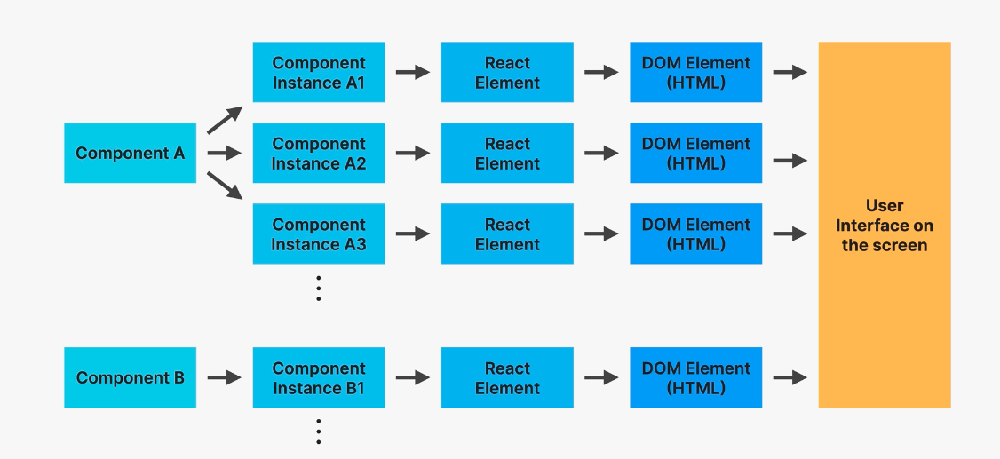
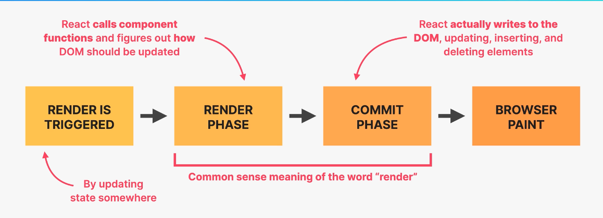
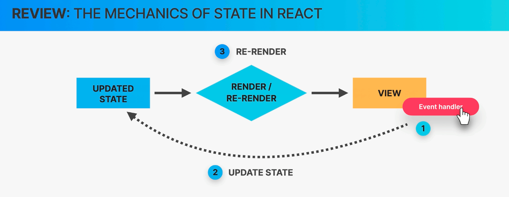
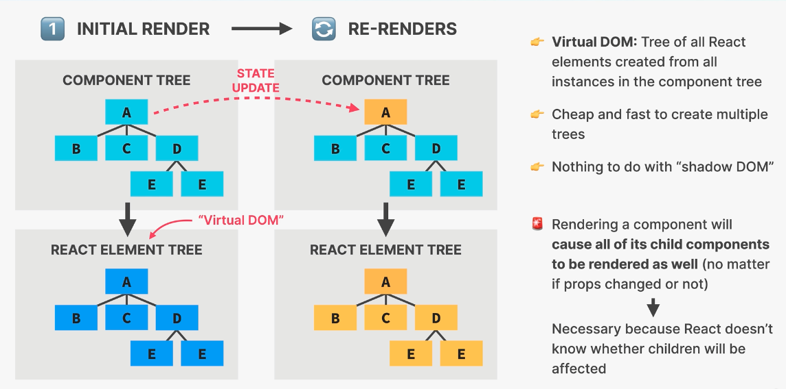
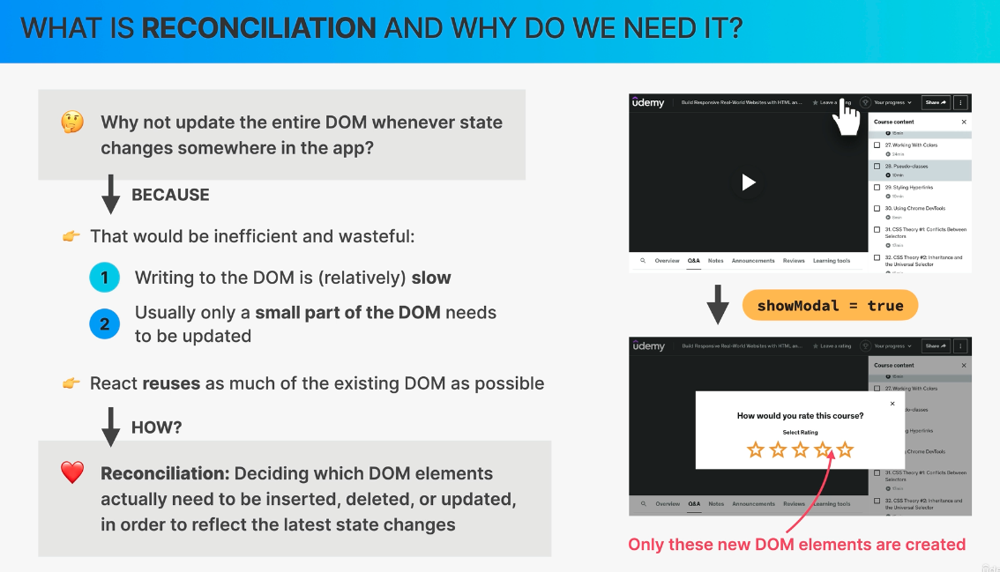
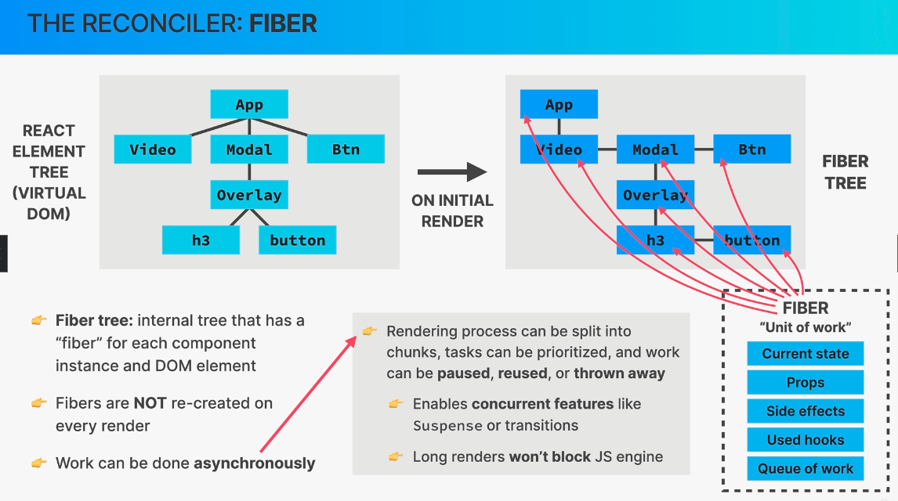
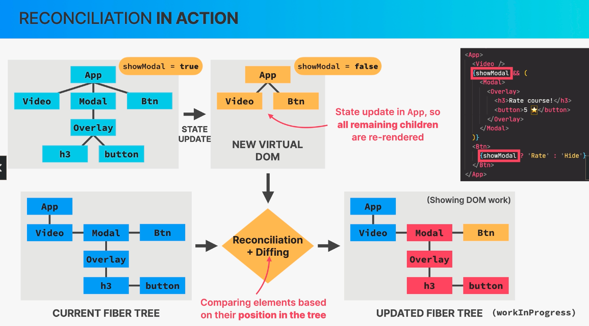
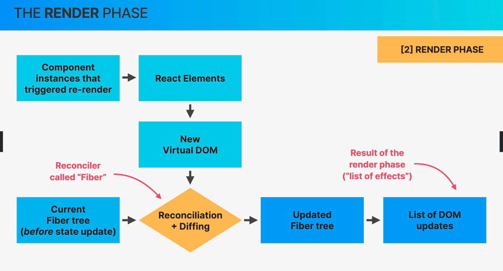
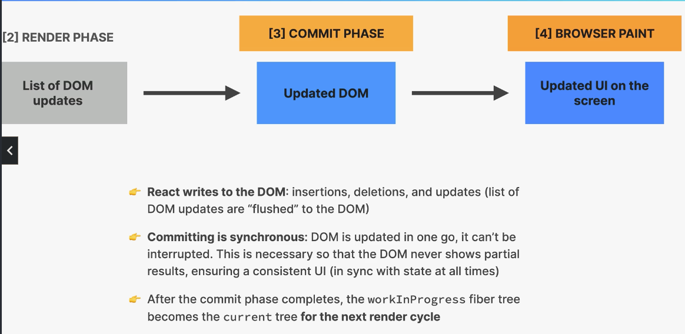
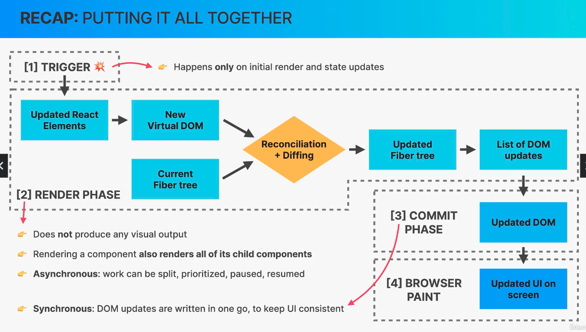

# How React works behind the scene?

## 1. [Components](#components), [Instances](#instances) and [Elements](#react-elements) (Popular Interview Question)

### Components:

- It is nothing but, description of a piece of UI
- A component is function that Returns React elements
- It is a "Blueprint" or "Templates", which is used to create multiple instances.
- e.g. Tab function

### Instances:

- Instances are created when we use these components
- e.g in App when we see <Tab .../> It is an instance.
- Actual physical manifestation of a component.
- More like Java Class and Instances.
- Instance can born, live and die (lifecycle)
- Returns one or more React "[Elements](#react-elements)"
  We use these 2 terms interchangably.

### React Elements:

- JSX is converted to React.createElement() function calls.
- A react element is the result of these function calls.
- Information necessary for DOM elements for current instance is stored in the element.
- Elements insert [DOM elements](#dom-elements) in the DOM.

### DOM ELements (HTML):

- These are the final elements that are rendered to the DOM.
- Actual visual representation of the component instance in the browser.

#### Experiment:

1. if we write console.log(<DifferentContent test={23} />); this line in the App.j
2. we will be able to see how a component instace stores information to create a HTML element.

Why we don't write DifferentContent(),

- React doesn't see this as a component instance, but as a raw output.
- We need to call it <DifferentContent /> for it to see as React Component.

## 2. How Rendering Works: Overview

### Overview: How components are displayed on the screen.

- When a render is triggered, when a state changes,
- Next phase is Render phase: React calls the component functions and figures out how dom should be updated.
- Rendering only happens inside react, internally. It does not produce visual changes.
- Next is Commit phase, new elements can be added existing elements are updated or deleted.
- Browser paint phase: which actually does the changes in the display that we see.

### How render are Triggered?

Two ways:

1. Initial Render: Start of the Application.
2. State is updated in one or more component instances (re-render).

Re-rendering rerenders the entire application, but, on the browser side, we can only see re-render of components that have been updated.

In practice it looks like only the react only re-renders the component where the state update has happened, but that's not how it works behind the scenes.

A render is not triggered immediately, but scheduled for when the JS engine has some
free time". There is also, batching of multiple setState calls in event handlers.

## 3. How Rendering Works: The Render Phase

### The render phase:

At the beginning, React goes through the react component tree and calls the component function.
Creates React element tree (Virtual DOM)

- Virtual Dom: Component Tree => React Element Tree (Virtual DOM)
- It is cheap and fast to create Virtual DOM (since its juts a JS object)
- Nothing to do with shadow DOM

State Update in component tree will trigger the re-render

Reconciliation + Diffing happens in Current Fibre Tree (before state update) and Updated Fibre Tree.

Why we need all of these?

- Creating Virtual DOM is cheap and fast because it is JS object, but writing to DOM is not cheap and it is slow.
- Usually small part of the DOM is changed and needs to be updated.

Render phase is implemented by React library.

### The commit phase:

React writes to DOM: insertion, deletion, updates
Commit phase is synchronous: DOM is updated in one go.
After Commit phase completes, the workInProgress fibre tree becomes the current tree, for the next render cycle.
This is done by ReactDOM library.

### Browser Paint:

Updated UI on the screen (more on browser side and not on React side)

We can use ReactNative to write to native applications.
We can create videos using Remotion, and we can do many other things.

## 4. How Diffing Works?

This mechanism is based on 2 fundamental assumptions:

1. 2 elements of different types will produce different trees.
2. Elements with stable keys will stay same across renders.

Case:

1. Same position Different Element

   Element changed the position in the TREE.
   React assumes the entire subtree is not valid
   Old components are destroyed and removed from DOM, including state.
   Tree might be rebuilt if children stayed the same(state is reset).

2. Same Position Same Element

   Elemnt does not move nor does it change in the TREE.
   Simply Kept in the DOM along with the component state.
   If the props change, then the object is mutated instead of destroying or removed from the DOM.
   So, we keep the state as well.
